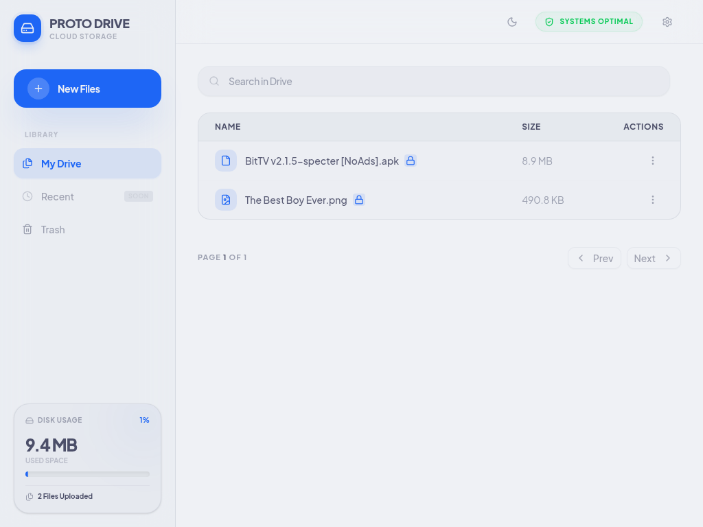
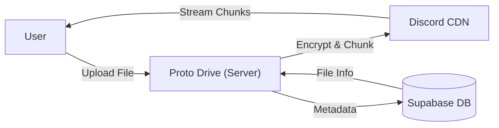

# Proto Drive 📁☁️

> [!NOTE]
> Proto Drive is evolved from the original [Neko Drive](https://github.com/kuchingneko28/neko-drive). This project serves as a high-performance, stateless cloud storage prototype.

**Unlimited, Secure, and High-Speed Cloud Storage backed by Discord.**

Proto Drive turns Discord's massive CDN into your personal, encrypted file system. It bypasses file size limits by smart-chunking, secures everything with AES-256, and runs entirely statelessly.

## ✨ Key Features

- **📂 Unlimited Storage**: Encrypted chunking logic stores file data on **Discord**.
- **⚡ High Performance**: Metadata stored in **Supabase (PostgreSQL)** for instant access.
- **🚀 Scalable & Stateless**: Fully stateless backend, optimized for **Vercel** and **Bun**.
- **🔒 Zero-Knowledge**: Files are encrypted **before** they touch Discord. Only you have the key.
- **⚡ Parallel Processing**: High-speed uploads/downloads using parallel shard management.
- **📱 Modern UI**: Built with React 19, TailwindCSS v4, and a premium design aesthetic.
- **🛠️ Atomic Integrity**: Uses PostgreSQL RPCs to ensure database consistency during complex operations.

## ⚙️ How it Works

1. **Upload**: Files are chunked into 4MB shards, encrypted locally, and sent to Discord as attachments.
2. **Metadata**: File structure, shard mappings, and encryption metadata are stored in Supabase.
3. **Access**: The app streams shards directly from Discord and decrypts them in-flight for the user.

## 🚀 Quick Start (Deployment)

### 1. External Services Setup

- **Discord**: Create a [Bot Application](https://discord.com/developers/applications), enable **Message Content Intent**, and copy the token.
- **Supabase**: Create a project, run the `supabase_schema.sql` script in the SQL Editor, and copy your API credentials.

### 2. Environment Variables

You will need the following keys:

- `DISCORD_BOT_TOKEN`
- `DISCORD_CHANNEL_ID`
- `SUPABASE_URL`
- `SUPABASE_SERVICE_ROLE_KEY`
- `API_SECRET` (A custom shared secret between client and server)
- `VITE_MASTER_KEY` (Your 32-char AES encryption key)

### 3. Vercel Deployment

Simply connect your fork to vercel-cli. The project is configured to handle the build and deployment automatically via `vercel.json`.

## 🛠️ Local Development

1. **Clone**: `git clone https://github.com/rizzbrew/proto-drive.git`
2. **Install**: `bun run install:all`
3. **Config**: Create `server/.env` based on `server/.env.example`.
4. **Run**: `bun run dev`

## 📄 License & Disclaimer

MIT License. **Educational Purpose Only.**
This project uses Discord's CDN for storage. Please comply with Discord's Terms of Service and use responsibly for personal, small-scale projects.
